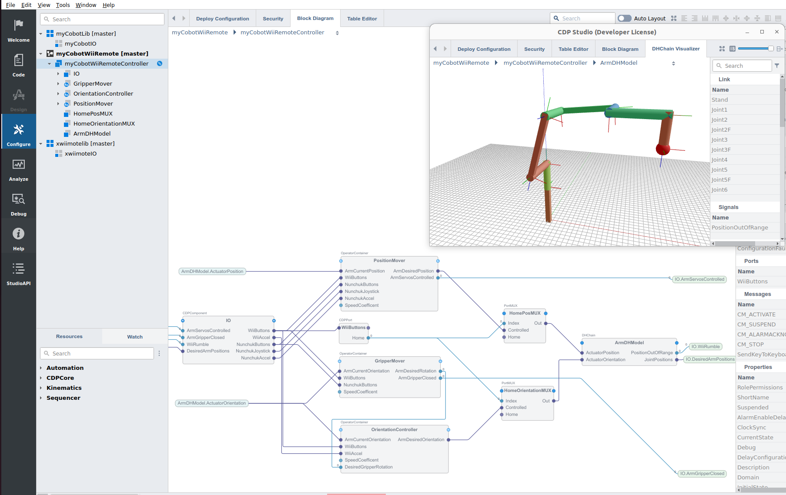

# Remote controller for 6-DOF myCobot robot arm using Wii Remotes

The myCobotWiiRemote CDP system shows how CDP Studio can be used to control a myCobot 6-DOF robot arm using the Wii Remote.

### Supported features
* The arm current position can be 3D-visualized, using CDP Studio and ArmDHModel (DHChain Visualizer, see the screenshot above) - therefore the application can be tested out also without the actual myCobot arm present, by running it on any Linux OS target, like Raspberry PI
* Supports controlling the myCobot arm Adaptive Gripper addon

### Wii remote actions supported
* **Wii button 1** - sets arm servo motors into released mode (default mode on startup)
* **Wii button 2** - sets arm servo motors into engaged mode (this mode is needed to be set first, to make the arm actually start moving)
* **Wii button Home** - sets the arm into a "home" (initial) position. Home position can easily be reconfigured in the application Home ports
* **Wii array keys left/right** - rotate the arm endpoint (gripper) to make it possible to grip at different angles
* **Wii tilting while button A is pressed** - tilt the arm endpoint to corresponding direction
* **Wii Nunchuk button C (upper button)** - toggle between gripper open/close
* **Wii Nunchuk joystick up/down** - move arm endpoint forward/backward
* **Wii Nunchuk joystick left/right** - move arm endpoint left/right
* **Wii Nunchuk tilting while button Z (lower button) is pressed** - move arm endpoint up/down

### Dependencies
* [xwiimotelib](https://github.com/CDPTechnologies/xwiimotelib) - a CDP library to communicate with Nintendo Wii / Wii U remotes
* [myCobotLib](https://github.com/CDPTechnologies/myCobotLib) - the IOServer to interface with myCobot PI arms
* A [Wii Remote](https://en.wikipedia.org/wiki/Wii_Remote)
* A myCobot arm with PI support (see https://www.elephantrobotics.com/en/mycobot-pi/)
* Optional myCobot arm Adaptive Gripper (see https://shop.elephantrobotics.com/products/adaptive-gripper)
